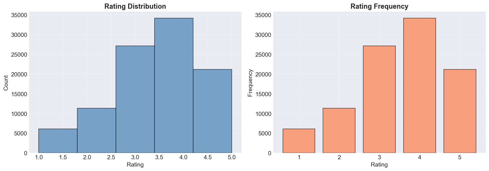
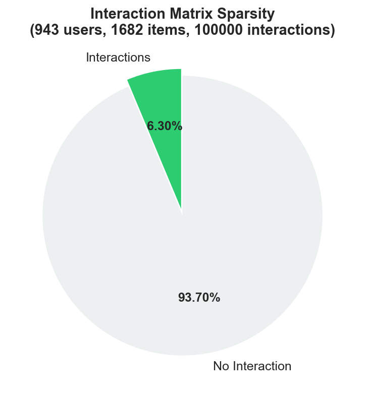
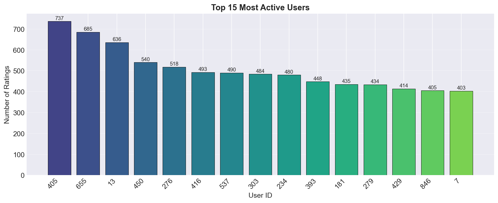
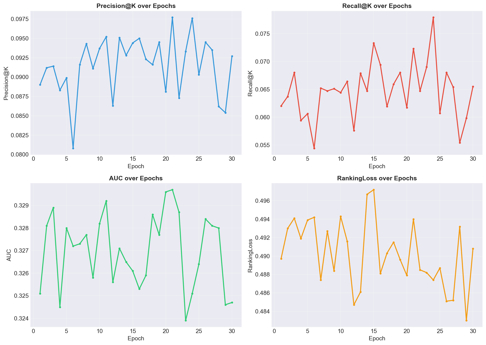
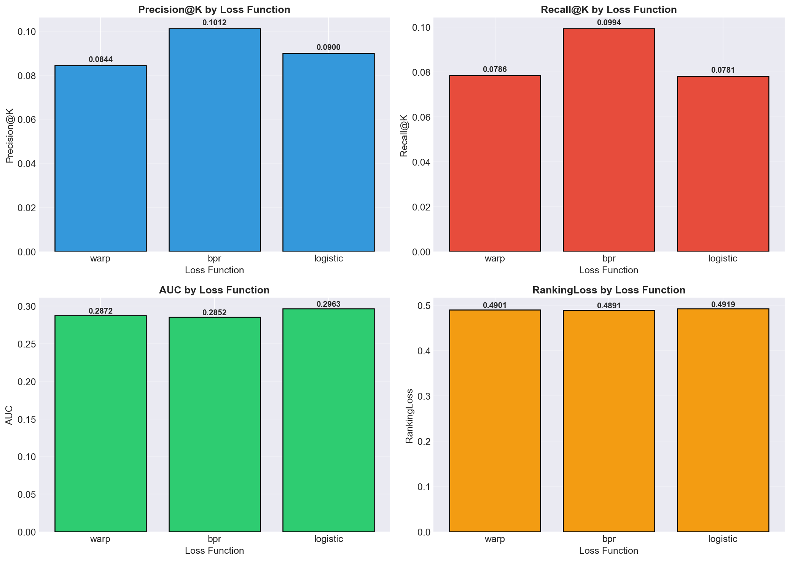
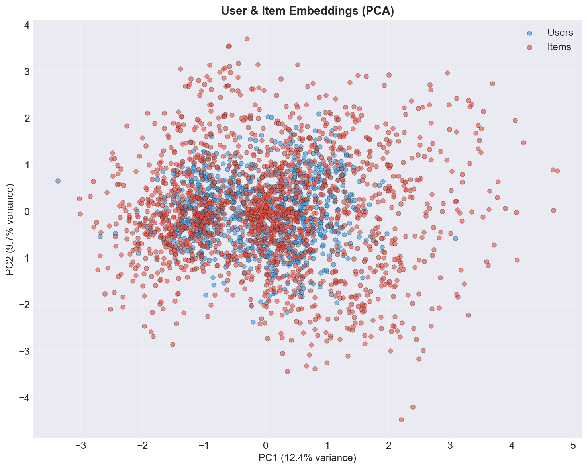

# Recommendation System with LightFM

**A Hybrid Recommendation System built with Python and LightFM algorithm**

## Project Overview

This project implements a hybrid recommendation system using matrix factorization techniques similar to those used by Netflix, Amazon, Spotify, and YouTube. The system learns latent representations of users and items from interaction data and generates personalized recommendations.

Built as part of the **CodTech IT Solutions Machine Learning Internship**.

## Objective

Build a production-quality recommendation engine that:
- Learns user preferences from implicit/explicit feedback
- Generates personalized top-N recommendations
- Handles the cold-start problem through hybrid features
- Evaluates performance using standard information retrieval metrics

## Features

| Feature | Description |
|---------|-------------|
| **Matrix Factorization** | Latent factor model learning user/item embeddings |
| **Multiple Loss Functions** | WARP, BPR, and Logistic loss support |
| **Configurable Hyperparameters** | Embedding size, learning rate, epochs, etc. |
| **Evaluation Suite** | Precision@K, Recall@K, AUC, Ranking Loss |
| **Loss Comparison** | Compare performance across different loss functions |
| **Epoch Analysis** | Track metrics progression across training epochs |
| **Visualization** | Rating distribution, sparsity, embeddings, training curves |
| **Model Persistence** | Save/load trained models via pickle |
| **Modular Architecture** | Clean separation of data, model, evaluation, and visualization |

## Technology Stack

| Technology | Purpose |
|------------|---------|
| **Python 3.10+** | Core programming language |
| **NumPy** | Numerical computation and matrix operations |
| **Pandas** | Data manipulation and analysis |
| **SciPy** | Sparse matrix construction (CSR format) |
| **Matplotlib** | Data visualization and graph generation |
| **scikit-learn** | PCA for embedding visualization |
| **Pickle** | Model serialization and persistence |

## Project Structure

```
recommendation-system-with-lightfm/
│
├── dataset/               # MovieLens 100K dataset
│   └── ml-100k/
│
├── models/                # Model storage
│
├── outputs/
│   ├── graphs/            # Generated visualizations
│   ├── recommendations/   # Top-N recommendation CSVs
│   └── trained_model/     # Saved model files
│
├── src/
│   ├── __init__.py
│   ├── utils.py           # Configuration and helpers
│   ├── data_loader.py     # Dataset download and loading
│   ├── preprocessing.py   # Cleaning, mapping, matrix building
│   ├── train.py           # LightFM algorithm implementation
│   ├── recommend.py       # Recommendation engine
│   ├── evaluate.py        # Evaluation metrics
│   └── visualization.py   # Graph generation
│
├── requirements.txt
├── README.md
└── main.py                # Entry point
```

## Dataset

**MovieLens 100K** — 100,000 ratings from 943 users on 1,682 movies.

- **Users**: 943
- **Items (Movies)**: 1,682
- **Interactions**: 100,000
- **Sparsity**: 93.70%
- **Rating Scale**: 1-5 stars
- **Source**: [GroupLens Research](http://files.grouplens.org/datasets/movielens/ml-100k.zip)

The dataset is downloaded automatically on first run.

## Installation

### Prerequisites

- Python 3.8 or higher
- pip package manager

### Setup

```bash
# Clone the repository
git clone https://github.com/your-username/recommendation-system-lightfm.git
cd recommendation-system-lightfm

# Install dependencies
pip install -r requirements.txt

# Run the project
python main.py
```

## How to Run

```bash
python main.py
```

The script will automatically:
1. Download the MovieLens 100K dataset
2. Perform exploratory data analysis
3. Clean and preprocess the data
4. Build user-item interaction matrices
5. Train the LightFM model (WARP loss by default)
6. Generate personalized recommendations
7. Evaluate model performance
8. Compare different loss functions
9. Track metrics across training epochs
10. Generate visualizations
11. Save the trained model

## Algorithms Used

### Matrix Factorization

The core algorithm factorizes the user-item interaction matrix into two lower-dimensional matrices:
- **User Embeddings**: Latent features representing user preferences
- **Item Embeddings**: Latent features representing item characteristics

The predicted score for a user-item pair is:
```
score(u, i) = bias_u + bias_i + embed_u · embed_i
```

### Loss Functions

| Loss | Description | Best For |
|------|-------------|----------|
| **WARP** | Weighted Approximate-Rank Pairwise loss | Implicit feedback, top-N ranking |
| **BPR** | Bayesian Personalized Ranking | Pairwise preference ranking |
| **Logistic** | Pointwise logistic regression | Explicit ratings, binary feedback |

### Negative Sampling

For each positive interaction, the model randomly samples a negative item (that the user hasn't interacted with) to learn the relative preference ordering.

## Evaluation Metrics

| Metric | Description | Range |
|--------|-------------|-------|
| **Precision@K** | Fraction of recommended items that are relevant | [0, 1] |
| **Recall@K** | Fraction of relevant items that are recommended | [0, 1] |
| **AUC** | Area Under the ROC Curve | [0, 1] |
| **Ranking Loss** | Fraction of incorrectly ordered item pairs | [0, 1] |

## Output Screenshots

### Rating Distribution


### Interaction Sparsity


### Top Active Users


### Training Progress


### Loss Function Comparison


### Embedding Visualization


## Configuration

Edit `src/utils.py` to tune model parameters:

```python
CONFIG = {
    "model_params": {
        "no_components": 30,     # Embedding dimensions
        "learning_rate": 0.05,   # SGD learning rate
        "max_sampled": 10,       # Max negative samples for WARP
        "random_state": 42,      # Reproducibility seed
    },
    "train_params": {
        "epochs": 30,            # Training iterations
        "num_threads": 1,        # Thread count
    },
    "eval_params": {
        "k": 10,                 # Top-K for evaluation
        "test_size": 0.2,        # Train/test split ratio
    },
}
```

## Future Improvements

- [ ] Add user and item feature matrices for cold-start handling
- [ ] Implement hybrid features with content metadata
- [ ] Add hyperparameter tuning (grid search)
- [ ] Support for larger datasets (MovieLens 25M, Amazon Reviews)
- [ ] Web API using FastAPI for production deployment
- [ ] Interactive dashboard with Streamlit
- [ ] Online learning for real-time updates
- [ ] GPU acceleration for large-scale training

## Internship Details

| Field | Value |
|-------|-------|
| **Organization** | CodTech IT Solutions |
| **Internship** | Machine Learning Internship |
| **Project** | Recommendation System with LightFM |
| **Intern ID** | CITS5452 |
| **Language** | Python |
| **IDE** | VS Code |
| **Platform** | Windows |

## License

This project is submitted as part of the CodTech IT Solutions internship program.

## Acknowledgments

- [GroupLens Research](https://grouplens.org/) for the MovieLens dataset
- [LightFM](https://github.com/lyst/lightfm) paper by Maciej Kula
- CodTech IT Solutions for the internship opportunity
